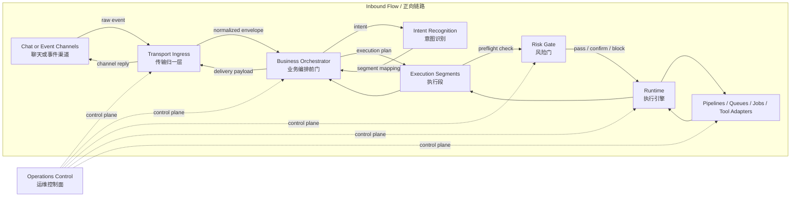

# Multi-Channel Gateway and Execution Model
# 多渠道网关与执行模型架构设想

> **Public architecture concept for open-source discussion.**  
> **面向开源讨论的公开架构设想文档。**
>
> This document uses generic terminology and omits sensitive business details. It describes a direction, not a final production commitment.  
> 本文使用通用术语，隐去敏感业务细节。内容是一种架构方向，而非最终生产承诺。

---

## Table of Contents / 目录

1. [Positioning / 定位](#1-positioning--定位)
2. [Terminology / 术语表](#2-terminology--术语表)
3. [Core Objectives / 核心目标](#3-core-objectives--核心目标)
4. [Layered Model / 分层模型](#4-layered-model--分层模型)
5. [Boundary Definitions / 边界定义](#5-boundary-definitions--边界定义)
6. [Execution Model / 执行模型](#6-execution-model--执行模型)
7. [Composition Protocol / 组合协议](#7-composition-protocol--组合协议)
8. [Delivery Invariants / 交付不变量](#8-delivery-invariants--交付不变量)
9. [Context Model / 上下文模型](#9-context-model--上下文模型)
10. [Execution Primitives / 执行原语](#10-execution-primitives--执行原语)
11. [Risk Gate / 风险门](#11-risk-gate--风险门)
12. [Error Handling and Recovery / 错误处理与恢复](#12-error-handling-and-recovery--错误处理与恢复)
13. [Observability / 可观测性](#13-observability--可观测性)
14. [Adoption Path / 演进路径](#14-adoption-path--演进路径)
15. [Open-Source Note / 开源说明](#15-open-source-note--开源说明)

---

## 1. Positioning / 定位

This concept targets systems that receive requests from one or more chat-like or event-driven channels, interpret user intent through a single logical frontdoor, and execute work through a small set of stable contracts.  
该设想面向这样一类系统：请求来自一个或多个聊天式或事件驱动式入口，由唯一的逻辑前门统一理解需求，再通过少量稳定执行契约来完成执行。

The main design goal is to keep channel-specific behavior out of business logic, while preventing the frontdoor from becoming an unbounded "do everything" layer.  
核心目标是把渠道细节隔离在业务逻辑之外，同时避免业务前门膨胀成无边界的"万事通"层。

---

## 2. Terminology / 术语表

| Term / 术语 | 中文说明 | English Description |
| :--- | :--- | :--- |
| `Transport Ingress` | 传输归一层 | Normalizes channel and webhook events into a stable inbound contract. |
| `Business Orchestrator` | 业务编排前门 | The single logical frontdoor that interprets requests and produces execution plans. |
| `Triage Stage` | 前置判断阶段 | Internal decision stage that classifies requests before execution begins. |
| `Execution Segment` | 执行段 | A stable execution contract responsible for a specific class of work. |
| `Risk Gate` | 风险门 | Pre-execution layer that evaluates safety, approval, and policy compliance. |
| `Operations Control` | 运维控制面 | The control-plane function for release, rollback, and platform management. |
| `DeliveryContext` | 单次交付上下文 | Short-lived context scoped to one request-response interaction. |
| `CaseContext` | 长流程上下文 | Persistent context for workflows spanning multiple turns or waiting points. |
| `ExecutionPlan` | 执行计划 | Durable plan that encodes segments, composition mode, and final-write ownership. |

---

## 3. Core Objectives / 核心目标

- **Isolate transport from business logic.**  
  把传输适配从业务决策中隔离出去。

- **One frontdoor, one visible reply surface, one final writer per request.**  
  每个请求只有一个业务前门、一个可见回复面、一个 final writer。

- **Compress unbounded business scenarios into a small set of stable execution contracts.**  
  用少量稳定执行契约承接不断增长的业务场景。

- **Make long-running work recoverable, inspectable, and auditable.**  
  让长流程具备可恢复、可检查、可审计能力。

- **Keep business execution separated from operations and control-plane actions.**  
  将业务面执行与运维控制面动作彻底分离。

---

## 4. Layered Model / 分层模型

---

## 5. Boundary Definitions / 边界定义

### 5.1 Transport Ingress — 传输归一层

The gateway layer that normalizes channel events into a stable inbound contract. It has no role in business logic.  
将渠道事件归一为稳定入站契约的网关层，与业务逻辑完全无关。

**Does / 负责**

| | |
| :--- | :--- |
| Webhook and socket intake | Webhook 与 socket 接入 |
| Signature and challenge handling | 签名与 challenge 处理 |
| Fast transport-level ACK | 传输层快速 ACK |
| Event deduplication | 事件去重 |
| Session and reply-anchor normalization | 会话与回复锚点归一 |
| Channel capability detection | 渠道能力识别 |
| Transport feedback: typing, busy, retry, fallback | 传输反馈：typing、busy、重试、降级 |

**Does not / 不负责**

| | |
| :--- | :--- |
| Business intent interpretation | 业务意图解释 |
| Execution segment selection | 执行段选择 |
| Control-plane decisions | 控制面决策 |
| User-visible business reasoning | 面向用户的业务理解 |

> **Engineering note / 工程说明**  
> This layer is inherently stateful. Dedup windows, session mappings, reply anchors, and retry records must live in external state storage — not in process memory alone.  
> 该层本质上是有状态的。去重窗口、会话映射、回复锚点、重试记录必须存入外部状态存储，不能只依赖进程内存。

---

### 5.2 Business Orchestrator — 业务编排前门

The single logical frontdoor. Exactly one orchestrator, one visible reply surface, one final writer per request.  
唯一的逻辑业务前门。每个请求只有一个编排前门、一个可见回复面、一个 final writer。

**Does / 负责**

| | |
| :--- | :--- |
| Recognize intent | 识别意图 |
| Classify whether a request belongs to the business or operations plane | 判断请求属于业务面还是控制面 |
| Map to execution segments and produce a durable `ExecutionPlan` | 映射到执行段并产出可持久化的 `ExecutionPlan` |
| Preserve one visible delivery surface | 维护唯一可见交付面 |
| Decide final-write ownership | 确定 final writer 归属 |

> **Design note / 设计说明**  
> Intent classification logic should evolve as a rule executor and plan generator — not as an ever-growing pile of ad hoc conditions.  
> 意图识别逻辑应演进为"规则执行器 + 计划生成器"，而不是不断膨胀的临时条件堆。

---

### 5.3 Execution Segments — 执行段

Stable execution contracts that own predictable, inspectable work. Segment contracts remain stable even as business scenarios change.  
持有可预测、可检查执行语义的稳定契约。即使业务场景不断变化，执行段契约也保持稳定。

**Does / 负责**

| | |
| :--- | :--- |
| Execute according to the `ExecutionPlan` | 按照 `ExecutionPlan` 执行任务 |
| Expose consistent state transitions and waiting points | 暴露一致的状态转换与等待点 |
| Report structured results and failures to the orchestrator | 向编排层上报结构化结果与失败 |

---

### 5.4 Risk Gate — 风险门

A pre-execution decision layer that sits between execution segments and the runtime. All side-effecting actions must pass through it.  
位于执行段与 runtime 之间的预执行决策层。所有有副作用的动作都必须通过。

**Evaluation dimensions / 评估维度**

| Dimension | 维度 |
| :--- | :--- |
| Operation type: read / write / delete | 操作类型：读 / 写 / 删除 |
| Target-system criticality | 目标系统关键度 |
| Data sensitivity | 数据敏感级别 |
| Blast radius | 影响范围 |
| Reversibility | 可逆性 |

**Decisions / 决策**

| Decision | 说明 |
| :--- | :--- |
| `pass` — allow immediately | 低风险，直接放行 |
| `confirm` — require explicit approval | 中风险，需要显式审批（可通过策略规则或人工参与） |
| `block` — reject and notify operations | 高风险，拒绝执行并通知控制面 |

---

### 5.5 Operations Control — 运维控制面

The control-plane function that manages the entire system. It is separate from the business plane and should never be reached via normal business requests.  
管理整套系统的控制面职能，与业务面彻底分离，不通过普通业务请求触达。

**Responsibilities / 职责**

| | |
| :--- | :--- |
| Release, rollback, restart | 发布、回滚、重启 |
| Runtime and worker recovery | Runtime 与 worker 恢复 |
| Control-plane configuration changes | 控制面配置变更 |
| Policy override and recovery drills | 风险策略 override 与恢复演练 |
| Platform-level investigation | 平台级排障 |

---

## 6. Execution Model / 执行模型

### 6.1 Intent Segments — 意图识别段

These describe the shape of demand, not execution contracts. Example categories:  
这些段负责表达需求形态，而非执行契约。示例类别：

| Category | 类别 |
| :--- | :--- |
| Content creation and publishing | 内容创作与发布 |
| File and knowledge processing | 文件与知识处理 |
| Data synchronization | 数据同步 |
| Case-based approval workflows | Case 审批流程 |
| Web automation | 网页自动化 |
| Order and transaction flows | 订单与交易流程 |
| Research and monitoring | 研究与监测 |
| Analytics and reporting | 分析与报表 |
| Real-time decision support | 实时决策支持 |

---

### 6.2 Execution Segments — 执行段

Six recommended stable execution contracts:  
建议保留的六类稳定执行契约：

#### `Watcher Segment` — 观察段
Continuous observation, scheduled checks, anomaly monitoring, and follow-up verification.  
持续观察、定时检查、异常监测与后续回查。

#### `Artifact Workflow Segment` — 产物工作流段
Drafting, review, export, packaging, and publish flows centered on artifacts.  
以产物为中心的草稿、审核、导出、打包与发布流程。

#### `Case Flow Segment` — Case 流程段
Long-running flows with waiting points, approval steps, reminders, or pause/resume behavior.  
包含等待点、审批步骤、提醒点或暂停恢复能力的长流程。

#### `System Action Segment` — 系统写操作段
Side-effecting writes into external systems. Requires idempotency, preflight checks, and rollback awareness.  
面向外部系统的有副作用写操作。需要幂等性、预检与回滚感知。

#### `Knowledge Maintenance Segment` — 知识维护段
Quiet refresh, cleanup, deduplication, and distillation. Must support inspect, pause, validate, and rollback.  
静默刷新、清理、去重与蒸馏。必须支持检查、暂停、验证与回滚。

#### `Ops Escalation Segment` — 运维升级段
Explicit handoff to the operations and control plane.  
显式升级到运维控制面。

---

### 6.3 Triage Stage — 前置判断阶段

The `Triage Stage` lives inside the `Business Orchestrator`. It is not an execution segment and owns no runtime.  
`Triage Stage` 位于 `Business Orchestrator` 内部，不是执行段，也不持有独立 runtime。

It decides one of four outcomes for each request:  
它对每个请求做出以下四种判断之一：

| Outcome | 结果 |
| :--- | :--- |
| Direct handling — resolve immediately | 直接处理，当场完成 |
| Single segment — enter one execution contract | 单段执行，进入一条执行契约 |
| Composed plan — enter a multi-segment plan | 组合计划，进入多段执行计划 |
| Ops escalation — hand off to control plane | 升级控制面 |

---

## 7. Composition Protocol / 组合协议

When one intent maps to more than one execution segment, an explicit composition protocol must be used.  
当一个意图需要映射到多个执行段时，必须使用显式的组合协议。

### 7.1 Composition Modes / 组合模式

| Mode | Description | 说明 |
| :--- | :--- | :--- |
| `sequential` | Output of one segment becomes input to the next. | 前一段的输出成为后一段的输入。 |
| `parallel-then-join` | Multiple segments run in parallel and join before final delivery. | 多段并行执行，汇总后统一交付。 |
| `follow-up` | A secondary segment starts only after the primary finishes and the orchestrator decides. | 主段完成且编排层再次判断后，次段才启动。 |

### 7.2 Ownership Rules / 所有权规则

- Exactly one **primary segment** may write to the `DeliveryContext`.  
  只有一个 **primary segment** 可以写 `DeliveryContext`。

- All **secondary segments** may produce intermediate data or artifacts, but must never become the visible final writer.  
  所有 **secondary segment** 只能产出中间数据或产物，不能成为可见 final writer。

- The orchestrator must declare `final_writer_step` before execution begins.  
  编排层必须在执行开始前声明 `final_writer_step`。

### 7.3 Execution Plan Requirement / 执行计划要求

All multi-segment executions must be backed by a durable `ExecutionPlan` using either a clear state machine or a deterministic pipeline definition. Loose event choreography alone is insufficient for checkpointing, replay, audit, and recovery.  
所有多段执行都必须有可持久化的 `ExecutionPlan` 支撑，底层基于明确状态机或确定性 pipeline。单靠松散事件编排不足以支撑 checkpoint、重放、审计与恢复。

---

## 8. Delivery Invariants / 交付不变量

These invariants must hold regardless of how many channels or long-running workflows the system supports:  
无论系统支持多少渠道或长流程，以下不变量必须始终成立：

| Invariant | 不变量 |
| :--- | :--- |
| One request → one `DeliveryContext` | 一个请求只有一个 `DeliveryContext` |
| One request → one visible reply surface | 一个请求只有一个可见回复面 |
| One request → one final writer | 一个请求只有一个 final writer |
| Transport feedback ≠ semantic state | 传输反馈不等于业务语义状态 |
| Missing channel capability → graceful degradation, never silent drop | 渠道能力不足时必须优雅降级，不能静默丢弃 |

---

## 9. Context Model / 上下文模型

### 9.1 `DeliveryContext` — 单次交付上下文

Used for short-lived, single request-response interactions. Created at request start, closed on completion or failure.  
用于短生命周期的单次请求交付，随请求创建、随完成或失败关闭。

| Field | 字段 |
| :--- | :--- |
| `context_id` | 唯一标识 |
| `reply_target` | 回复锚点 |
| `semantic_state` | 语义状态 |
| `channel_capabilities` | 渠道能力快照 |
| `primary_segment` | 当前持有写权的执行段 |
| `created_at` | 创建时间 |
| `closed_at` | 关闭时间 |

### 9.2 `CaseContext` — 长流程上下文

Used for flows that span waiting points, multiple user turns, or background progression.  
用于跨等待点、多轮交互或后台持续推进的长流程。

| Field | 字段 |
| :--- | :--- |
| `case_id` | 唯一流程标识 |
| `case_state` | 当前流程状态 |
| `waiting_point` | 当前等待点 |
| `history_summary` | 历史操作摘要 |
| `last_active_at` | 最近活跃时间 |

### 9.3 Serialization Rule / 可序列化规则

All durable contexts and plans must be serializable and hydratable after restart. Never store live process handles, active sockets, or transient runtime objects inside them.  
所有可持久化的上下文与计划必须支持序列化与重启后 hydrate。不允许将活跃进程句柄、socket 或瞬时 runtime 对象存入其中。

---

## 10. Execution Primitives / 执行原语

### `direct` — 直接执行

Use only when **all** of the following conditions are true. Otherwise use an execution segment.  
仅当以下**所有**条件都满足时才使用，否则必须进入执行段。

| Condition | 条件 |
| :--- | :--- |
| Low risk | 低风险 |
| No external write | 无外部写操作 |
| No waiting point | 无等待点 |
| No durable artifact | 无需持久化产物 |
| No approval needed | 不需要审批 |
| Short execution window | 执行窗口很短 |

### `pipeline` — 流水线

For tightly coupled multi-step work that requires inspection, replay, and rollback.  
适用于步骤强耦合、需要 inspect、重放与回滚能力的多步骤任务。

### `queue or job` — 队列或定时任务

For background work, scheduled checks, pause/resume flows, or long-running cases.  
适用于后台任务、定时检查、暂停恢复流程或长时间运行 case。

---

## 11. Risk Gate / 风险门

### Evaluation Dimensions / 评估维度

| Dimension | 维度 | Values |
| :--- | :--- | :--- |
| Operation type | 操作类型 | `read` / `write` / `delete` |
| Target-system criticality | 目标系统关键度 | `low` / `medium` / `high` / `critical` |
| Data sensitivity | 数据敏感级别 | `none` / `internal` / `confidential` / `restricted` |
| Blast radius | 影响范围 | `single` / `batch` / `system-wide` |
| Reversibility | 可逆性 | `reversible` / `partial` / `irreversible` |

### Decision Outcomes / 决策结果

| Decision | When | 适用情况 |
| :--- | :--- | :--- |
| `pass` | Low-risk, reversible reads or writes | 低风险、可逆的读写操作 |
| `confirm` | Medium risk, or requires explicit authorization | 中风险或需要显式授权 |
| `block` | Critical or irreversible system-wide actions | 关键系统的不可逆操作 |

Approval for `confirm` decisions may come from policy rules or human-in-the-loop review.  
`confirm` 决策的审批既可来自策略规则，也可来自人工参与审批。

---

## 12. Error Handling and Recovery / 错误处理与恢复

### Error Flow / 错误流转

| Step | 步骤 |
| :--- | :--- |
| 1. Backend or runtime performs bounded retries (exponential backoff) | Backend 或 runtime 执行有限重试（指数退避） |
| 2. Execution segment converts failures into structured errors | 执行段将失败转换为结构化错误 |
| 3. Orchestrator decides: retry, surface failure to user, or escalate | 编排层决定：重试、展示失败给用户或升级 |
| 4. Transport ingress handles delivery retries independently | 传输归一层独立处理交付重试 |

### Recovery Principles / 恢复原则

| Principle | 原则 |
| :--- | :--- |
| Recover from the nearest checkpoint, not from scratch | 从最近的 checkpoint 恢复，而非整单重跑 |
| Prefer idempotency keys for all side-effecting actions | 对所有有副作用动作优先使用幂等键 |
| Apply circuit breaking after repeated segment failures | 对连续执行段失败使用熔断 |
| Escalate critical failures to the operations plane immediately | 将严重故障立即升级到控制面 |

---

## 13. Observability / 可观测性

A `trace_id` generated at the gateway layer must propagate end to end through every layer.  
由网关层生成的 `trace_id` 必须端到端贯穿每一层。

### Recommended Minimum Signals / 建议最小可观测信号

| Layer | Signal | 层级 | 指标 |
| :--- | :--- | :--- | :--- |
| Gateway | ACK latency, dedup rate, delivery failure rate | 网关 | ACK 延迟、去重率、交付失败率 |
| Orchestrator | Triage latency, segment distribution | 编排层 | Triage 延迟、执行段分布 |
| Execution Segments | Duration p99, error rate, retry count | 执行段 | 耗时 p99、错误率、重试次数 |
| Risk Gate | Pass / confirm / block distribution, gate latency | 风险门 | pass/confirm/block 分布、决策延迟 |
| Runtime / Backend | Execution duration, external API error rate | 执行后端 | 执行耗时、外部 API 错误率 |

---

## 14. Adoption Path / 演进路径

### Phase 1 — Stabilize the Execution Skeleton / 稳定执行骨架

| Task | 任务 |
| :--- | :--- |
| Define execution segment contracts | 定义执行段契约 |
| Make final-writer ownership explicit | 明确 final writer 归属 |
| Make all contexts serializable | 让所有上下文可序列化 |
| Validate recovery and circuit-breaking behavior | 验证恢复与熔断行为 |

### Phase 2 — Introduce the Gateway Layer / 引入网关层

| Task | 任务 |
| :--- | :--- |
| Add normalized inbound envelopes | 引入归一化入站信封 |
| Isolate transport quirks from the orchestrator | 将渠道 quirks 隔离在编排层之外 |
| Validate that business decisions remain stable | 验证业务判断结果不因 transport 变化而漂移 |

### Phase 3 — Add More Transport Channels / 接入更多渠道

| Task | 任务 |
| :--- | :--- |
| Add new channel adapters | 增加新的渠道适配器 |
| Keep the orchestrator and segment model unchanged | 保持编排层与执行段模型不变 |
| Verify graceful degradation and delivery parity | 验证优雅降级与交付一致性 |

---

## 15. Open-Source Note / 开源说明

This document is intentionally generalized for public sharing:  
本文档有意为公开发布做了泛化处理：

| Treatment | 处理方式 |
| :--- | :--- |
| Internal product names replaced with generic terms | 内部产品称呼替换为通用术语 |
| Channel-specific examples generalized | 渠道示例被泛化处理 |
| Sensitive operational details omitted | 敏感运维细节被省略 |
| Evolving areas described as direction, not commitment | 仍在演进的部分以"方向"而非"承诺"表达 |

The patterns described here are reusable for any multi-channel, long-running AI agent or workflow system. They are not specific to any single product.  
本文描述的模式适用于任何多渠道、长流程 AI Agent 或工作流系统，不特定于任何单一产品。
